# QA Agent OS Architecture

This document provides an overview of the architecture for the QA Agent OS, a system designed to generate contextual prompts and workflows for AI coding assistants.

## 1. Architectural Principles

The QA Agent OS is built on a set of core principles that guide its design and functionality:

-   **Modularity:** The system is divided into distinct components, each with a specific responsibility. This allows for easy maintenance, updates, and customization.
-   **Configurability:** The behavior of the system is driven by a central configuration file (`config.yml`), making it highly adaptable to different projects and requirements.
-   **Separation of Concerns:** The core logic (the "engine") is separated from the content (the "knowledge"). The engine consists of shell scripts that process the knowledge, which is stored in Markdown files.
-   **Profile-Based:** The system uses a profile-based approach, where a "profile" is a collection of standards, workflows, and commands that define the AI agent's behavior. This allows for different "personalities" or skill sets for the agent.

## 2. Component Breakdown

The project is organized into three main components: the Engine, the Configuration Layer, and the Knowledge Core.

### 2.1. The Engine (`scripts/`)

This directory contains the core logic of the system, responsible for processing the knowledge and generating the final output.

-   `project-install.sh` & `project-update.sh`: These scripts are the primary entry points for installing or updating the QA Agent OS in a target project. They read the configuration and orchestrate the assembly of the final prompt.
-   `common-functions.sh`: A library of shared shell functions used by the other scripts to reduce code duplication.
-   `create-profile.sh`: A utility script for creating new, custom profiles.

### 2.2. The Configuration Layer (`config.yml`)

This YAML file is the central control panel for the system. It defines:

-   Which AI agent model to target (e.g., "Claude Code").
-   Whether to use a single-agent or multi-agent setup.
-   Which profile to use for generating the context (e.g., `default`).
-   How to inject standards and conventions into the final prompt.

### 2.3. The Knowledge & Personality Core (`profiles/`)

This is the heart of the system, containing the actual content that defines the AI agent's capabilities and constraints.

-   `profiles/default/`: The standard, out-of-the-box profile.
    -   `standards/`: Contains Markdown files that define coding conventions, bug reporting standards, testing methodologies, and quality guidelines.
    -   `workflows/`: Defines multi-step processes for the AI agent to follow for complex tasks like bug reporting or feature implementation.
    -   `commands/`: Contains specific, single-purpose commands that can be triggered.
    -   `agents/`: Defines the roles and responsibilities of different sub-agents in a multi-agent configuration.

## 3. Workflow and Data Flow Diagram

The following diagram illustrates the process of how the QA Agent OS compiles the various components into a final, contextual prompt for an AI agent.

```mermaid
graph TD;
    subgraph "User Interaction"
        A[User] -->|Runs script| B(1. scripts/project-install.sh);
    end

    subgraph "Configuration & Knowledge"
        C{2. config.yml};
        D[3. profiles/default];
        D --> E[standards/];
        D --> F[workflows/];
        D --> G[commands/];
    end

    subgraph "Processing Engine"
        H((4. Compiler Engine in Scripts));
    end

    subgraph "Output & Final Usage"
        I([5. Final AI Agent Prompt]);
        J(🤖 AI Agent);
    end

    B --> C;
    C -->|Defines settings| H;
    E -->|Provides standards| H;
    F -->|Provides workflows| H;
    G -->|Provides commands| H;
    H -->|Generates| I;
    I -->|Provides context & instructions to| J;

```

### Data Flow Explanation:

1.  A **User** executes an installation or update script (e.g., `project-install.sh`).
2.  The script reads the `config.yml` file to determine which profile and settings to use.
3.  The script accesses the specified `profile` (e.g., `default`) and gathers all the necessary Markdown files from the `standards`, `workflows`, and `commands` directories.
4.  The **Compiler Engine** (the logic within the shell scripts) assembles these individual Markdown files into a single, cohesive prompt.
5.  The final output is a large, context-rich **AI Agent Prompt** that is ready to be used.
6.  This prompt is then provided to the **AI Agent**, giving it all the necessary instructions, conventions, and workflows to perform its tasks effectively within the target project.
